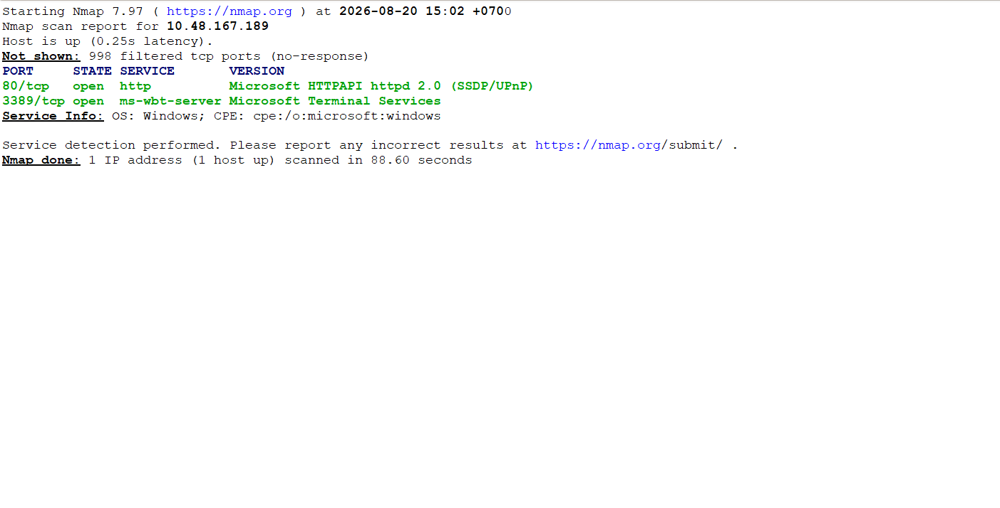
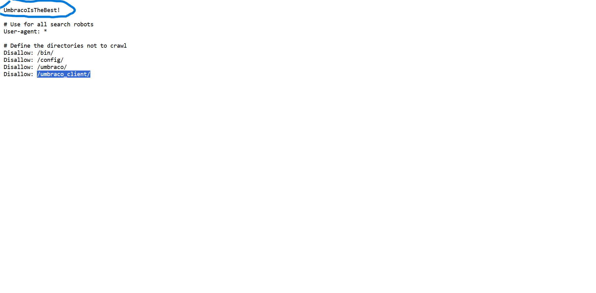
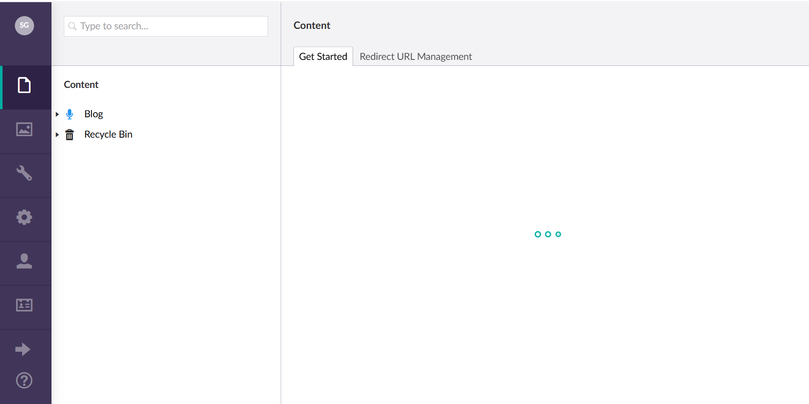
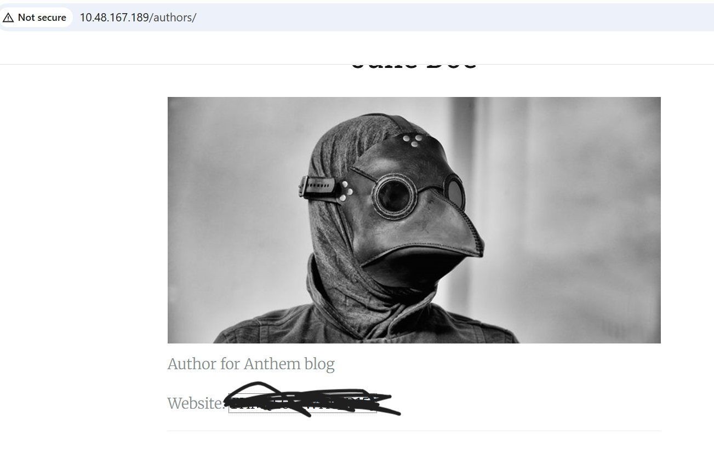
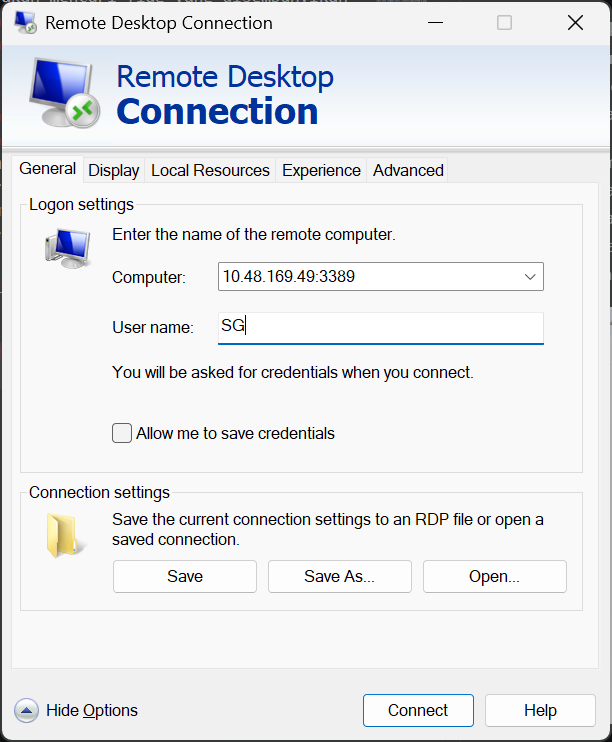
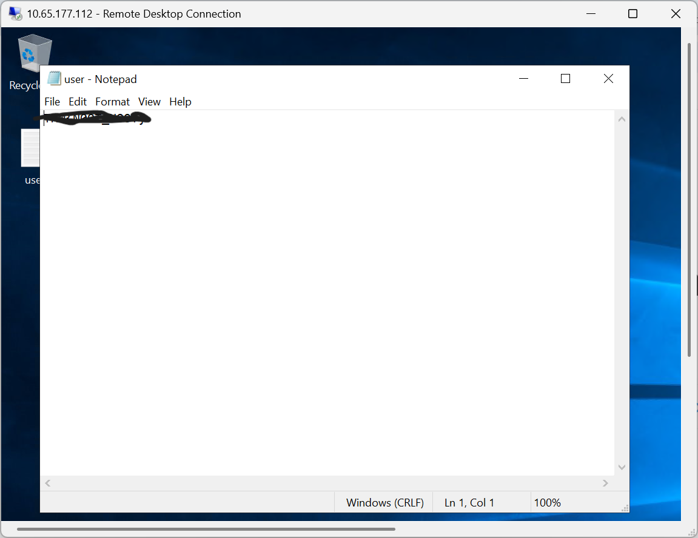
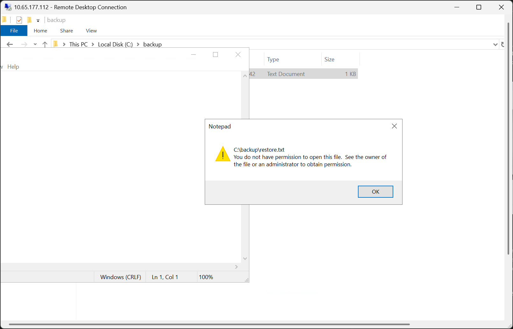
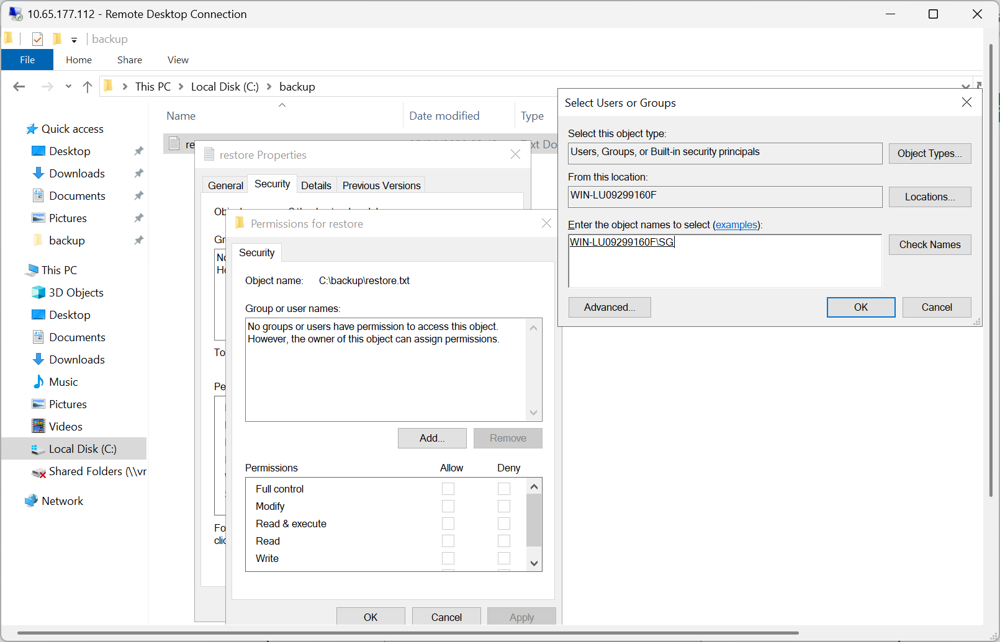
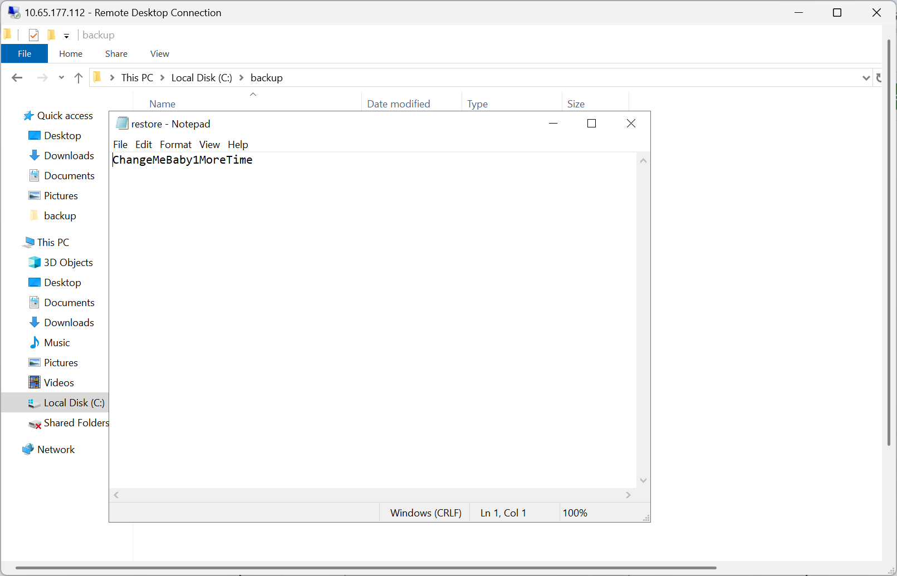
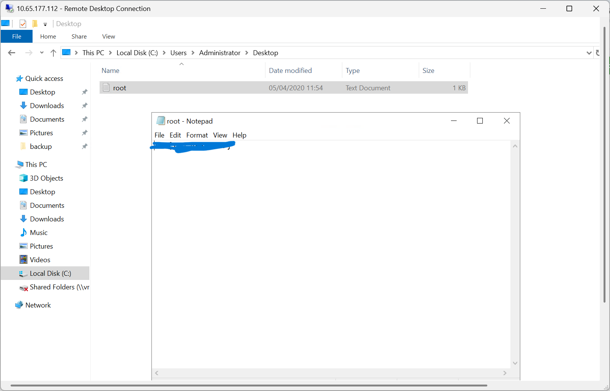

## Seksi Pertama
### Enumerasi Port dan Enumerasi Teknologi Website
Proses enumerasi port yang dilakukan untuk mengetahui service apa saja yang dijalankan oleh server dapat dilakukan melalui command **nmap -sT -sV alamat_ip**. Diketahui terdapat dua port yang terbuka pada server, yaitu Port 80 (HTTP), dan Port 3389 (RDP). Port 3389 akan kita simpan untuk seksi ketiga.

Aplikasi ini bernama **anthem.com**, bila kita mengakses direktori **/robots.txt** diketahui bahwa aplikasi menggunakan CMS Umbraco. File tersebut juga menjelaskan terdapat halaman admin pada direktori **/umbarco/** dengan password yang terdapat pada kalimat awal file. 

### Mencari Nama Administrator Melalui OSINT
Untuk mencari nama Administrator website ini, kita bisa melakukannya dengan teknik OSINT sederhana. Misalkan, bila kita mengakses halaman **/we-are-hiring/** dan memperhatikan nama seorang author kita bisa mengetahui bahwa format email yang digunakan adalah singkatan dari nama pertama dan nama belakang. Sebagai contoh Author dengan nama Jane Doe memiliki email **JD@anthem.com**.

Bila mengakses halaman **/a-cheers-to-our-it-department/** kita akan mendapati sebuah puisi karya Solomon Grundy yang didekisasikan untuk Administrator. Kita bisa mengasumsikan bahwa nama Administrator adalah **Solomon Grundy**, selain itu melihat pola penamaan email maka kita bisa mengetahui kalau alamat email Administrator adalah **SG@anthem.com**.

Bila kita uji hipotesis tersebut menggunakan password yang ditemukan pada file robots.txt, dan email yang didapatkan pada tahap ini kita bisa mengakses halaman administrator website anthem. Kita bisa menyimpan akronim administror **"SG"**, dan password dari file robots.txt yang didapatkan sebelumnya untuk koneksi RDP.

## Seksi Kedua
Pada seksi kedua ini kita akan mencari flag yang disembunyikan diantara tag-tag HTML, ataupun secara gamblang ditampilkan pada sebuah halaman tertentu. Untuk mendapatkannya kita bisa membuka developer console pada browser yang kita gunakan.

Flag pertama, dan ada di halaman **/archive/we-are-hiring/** lebih tepatnya terdapat pada header html bagian meta tag. Begitupula untuk flag keempat, kita bisa mendapatkannya pada halaman **/a-cheers-to-our-it-department/**. Flag ketiga dapat ditemui pada halaman **/authors/**, dan flag kedua terdapat pada tag input turunan dari class menu tag nav.

## Seksi Ketiga
Seksi ketiga dimulai dengan melakukan koneksi ke server menggunakan Remote Desktop Protocol (RDP). Pada Windows, koneksi dapat dilakukan menggunakan aplikasi RDP bawaan. Masukan alamat IP server, username, dan password untuk memulai sesi.

Setelah berhasil terhubung ke server, flag pertama pada seksi ini dapat ditemukan di direktori Desktop.

### Privilege Escalation
Untuk mendapatkan hak akses Administrator, diperlukan pencarian terhadap file tersembunyi yang terdapat pada server. Untuk menampilkan file tersembunyi, buka opsi View pada Ribbon, kemudian aktifkan Hidden items.

Setelah item tersembunyi ditampilkan, akses direktori **C:** terdapat sebuah folder benama backup yang berisi file bernama **restore**. Namun user SG belum memiliki izin untuk membaca file tersebut. Oleh karena itu, permission pada file perlu disesuaikan agar user SG memperoleh akses.

Untuk menambahkan permission, klik kanan file restore, kemudian pilih Properties → Security → Edit/Add. Pada bagian Enter the object names, masukkan SG, lalu pilih Check Names dan klik OK. Setelah permission berhasil ditambahkan, user SG dapat mengakses file tersebut dan proses privilege escalation dapat dilanjutkan.

Setelah permission berhasil ditambahkan, file restore dapat diakses dan berisi password untuk akun Administrator. Password tersebut kemudian dapat digunakan untuk melakukan login menggunakan akun Administrator.

Setelah berhasil masuk sebagai Administrator, akses direktori Desktop untuk menemukan flag terakhir pada room ini

